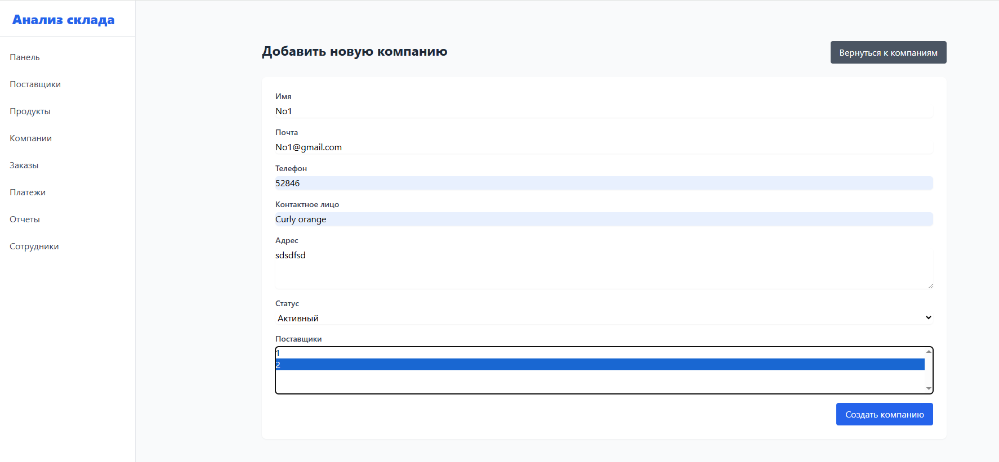
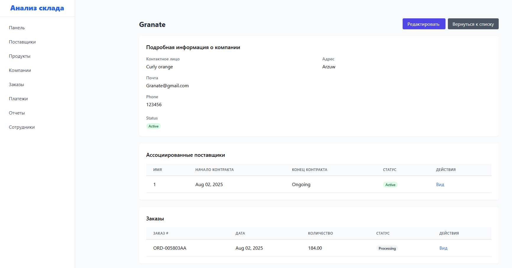
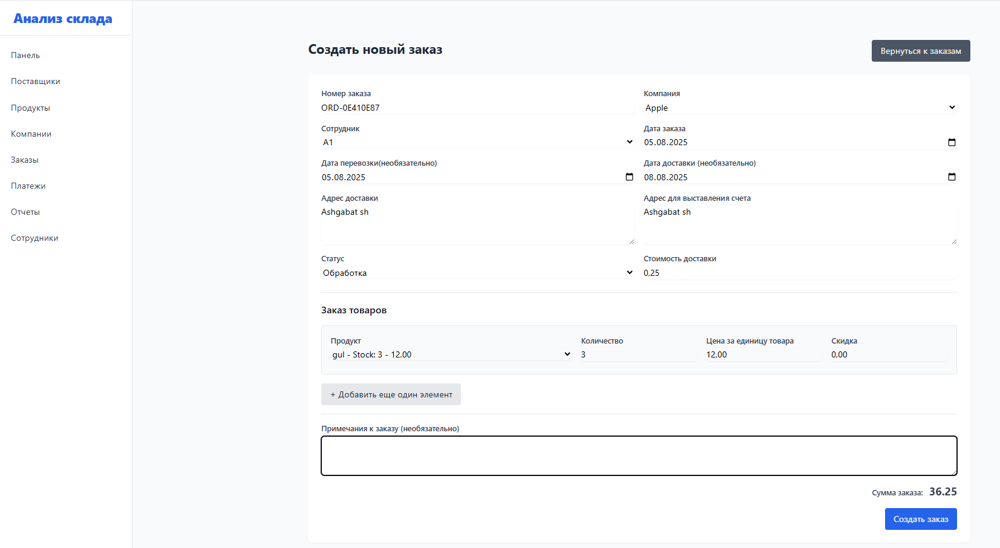
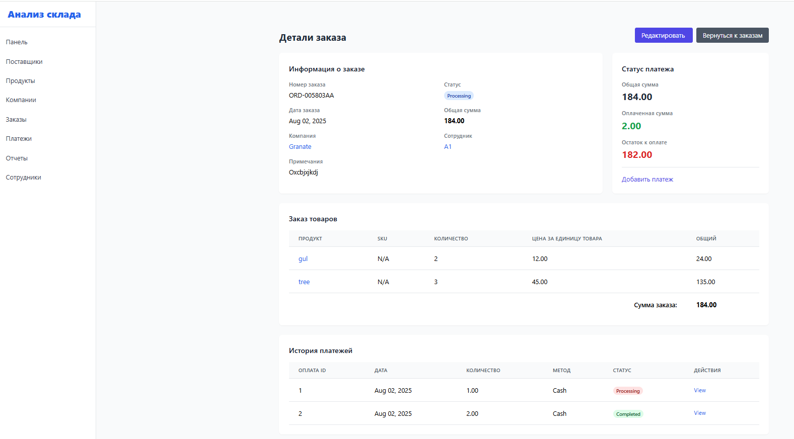
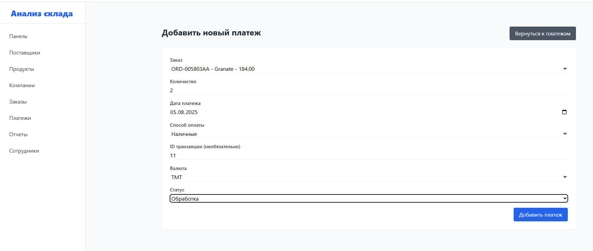
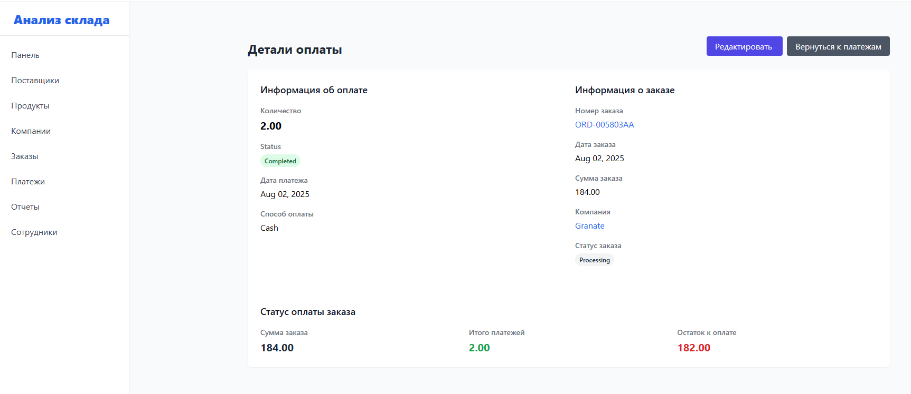
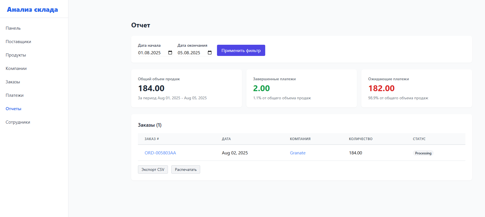
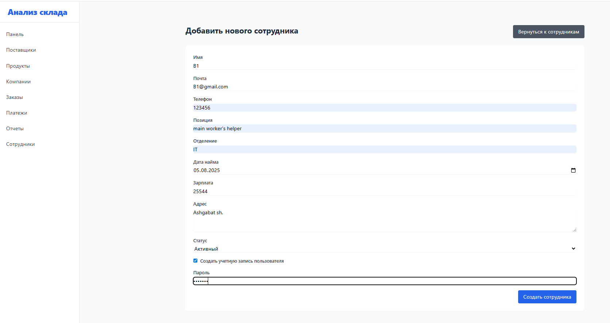
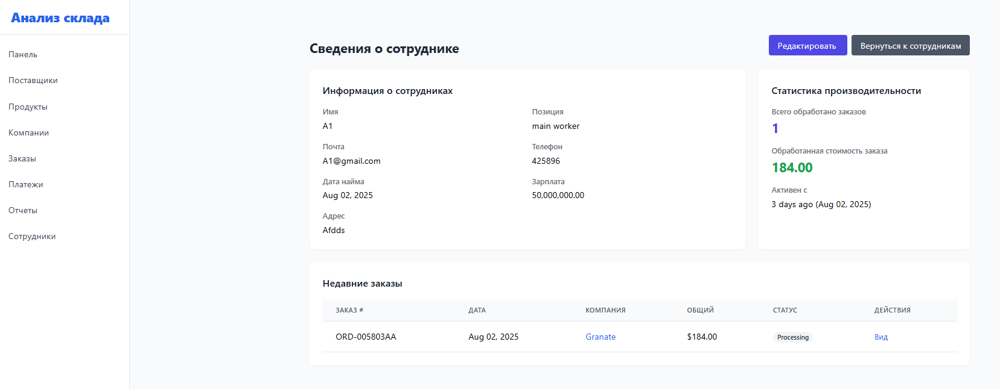

<h1>Анализ склада</h1>
<h2>Описание</h2>

Анализ склада — это система для управления складом, анализа продаж и платежей, построенная на Laravel. Включает управление товарами, поставками, заказами и отчетами с возможностью экспорта в CSV/PDF. Простой интерфейс для фильтрации и анализа данных о запасах и доходах.

<h2>Используемые языки и утилиты</h2>
<ul>
  <li><b>PHP</b> (Фреймворк Laravel)</li>
  <li><b>MySQL</b> (Управление базой данных)</li>
  <li><b>JavaScript</b> (Взаимодействие на фронтенде)</li>
  <li><b>HTML/CSS</b> (Макет и стилизация)</li>
  <li><b>Tailwind CSS</b> (Стилизация)</li>
</ul>

<h2>Используемые среды</h2>
<ul>
  <li><b>Windows 10</b> (21H2)</li>
  <li><b>Apache</b> (Веб-сервер)</li>
  <li><b>MySQL</b> (База данных)</li>
</ul>

<h2>Пошаговое руководство:</h2>

  <b>Шаг 1:</b> Для входа в систему используйте свой email и пароль. Если у вас нет аккаунта, зарегистрируйтесь по кнопке "Зарегистрироваться".  
  
   
  </b> Используйте меню для перехода к различным разделам: Заказы, Поставщики, Продукты, и т.д. Каждое меню приводит к отдельной странице, где отображаются данные о соответствующем разделе. 
    
  <b>Шаг 2:</b> В разделе "Поставщики" отображается список всех зарегистрированных поставщиков. Вы можете добавить нового поставщика, обновить данные или удалить его. 
    
    
  
  <b>Шаг 3:</b>  В разделе "Продукты" можно управлять товарами на складе, добавлять новые продукты, изменять количество или удалять товары.  
    
    
  
  <b>Шаг 4:</b> В разделе "Компания" отображаются все зарегистрированные компании. Вы можете добавлять новые компании, редактировать их данные, а также удалять их.  
    
    
  
  <b>Шаг 5:</b>  В разделе "Заказы" вы можете добавлять новые заказы, редактировать существующие и отслеживать их статус. Статусы заказов могут быть: "Ожидающий", "Выполненный", "Отмененный"  
    
    
  
  <b>Шаг 6:</b> В разделе "Платежи" вы можете отслеживать все финансовые транзакции, связанные с заказами и поставками. Доступны различные отчетные данные по платежам.  
    
    
  
  <b>Шаг 7:</b>  В разделе "Отчеты" доступны различные отчетные данные по продажам, заказам и доходам. Вы можете экспортировать данные в форматах CSV или PDF для дальнейшего анализа. 
  

   <b>Шаг 8:</b>   В разделе "Сотрудники" вы можете добавлять новых сотрудников, редактировать их данные и управлять их доступами. 
  
  

